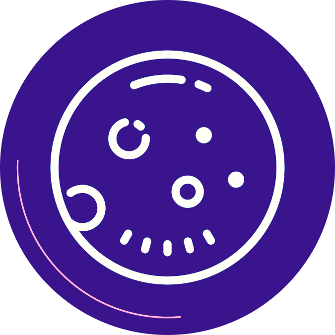

<div align="center">
  <a href="#">
    
  </a>

  <h1>Mooncake</h1>
  <p>A simple way to generate mocks for multiple purposes</p>

</div>


**Table of Contents**

- [What is Mooncake](#what-is-mooncake)
- [Getting Started]()
  - [Installation]()
  - [Mooncake Configuration File]()
  - [How to use]()
- [Examples]()
- [License]()


## What is Mooncake

Mooncake is a simple way to generate mocks for multiple purposes. 

Compatible with different types of interfaces as:

- Default interfaces

```go
type Simple interface{
  MyMethod()
}
```

- Nested interfaces

```go
type Nested interface{
  Simple
}
```

- Generic Interfaces

```go
type Generic[T,Z any] interface{
  MyCustomMethod(T) (T,Z)
}
```
- Generic Nested Interfaces

```go
type NestGeneric[T,Z any] interface{
  Generic[T,Z]
}
